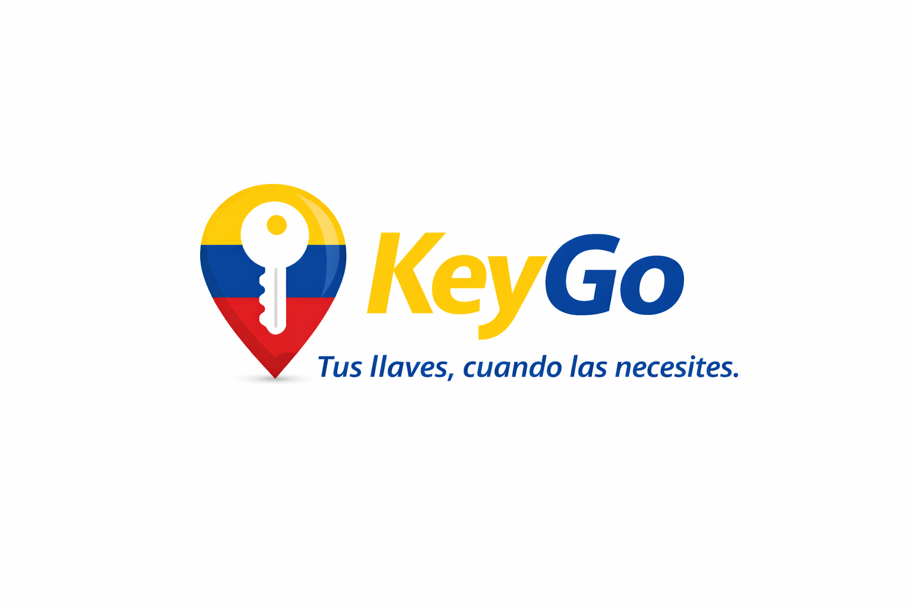

<p align="center">
  
</p>

<h1 align="center">KeyGo — Plataforma de Gestión Inteligente de Llaves</h1>

<p align="center">
  <em>Sistema completo para depositar, gestionar y autorizar el acceso a llaves físicas a través de puntos aliados, usando códigos digitales y tecnología NFC.</em>
</p>

<br/>

## 🚀 Tecnologías Utilizadas

 &nbsp;&nbsp; &nbsp;&nbsp; &nbsp;&nbsp; 

 &nbsp;&nbsp; &nbsp;&nbsp; &nbsp;&nbsp; 

 &nbsp;&nbsp; &nbsp;&nbsp; 

---

## 📋 Tabla de Contenidos

- [🎯 ¿Qué es KeyGo?](#-qué-es-keygo)
- [📅 Fases del Proyecto](#-fases-del-proyecto)
- [✅ Fase 1 — Entregable Completo](#-fase-1--entregable-completo)
- [🏗️ Arquitectura del Sistema](#️-arquitectura-del-sistema)
- [📁 Estructura de Carpetas](#-estructura-de-carpetas)
- [🗄️ Base de Datos — 12 Tablas](#️-base-de-datos--12-tablas)
- [🔒 Seguridad Implementada](#-seguridad-implementada)
- [📖 API y Documentación Swagger](#-api-y-documentación-swagger)
- [📱 App Móvil — Conexión con el Servidor](#-app-móvil--conexión-con-el-servidor)
- [🚀 Cómo Ejecutar el Proyecto](#-cómo-ejecutar-el-proyecto)
- [🔬 Guía de Pruebas para el Cliente](#-guía-de-pruebas-para-el-cliente)

---

## 🎯 ¿Qué es KeyGo?

KeyGo es una plataforma digital B2B2C que permite a los propietarios de llaves depositar y gestionar sus llaves físicas en **puntos aliados** (tiendas de barrio, ferreterías, droguerías). El sistema elimina la dependencia de copias físicas y garantiza trazabilidad completa mediante **códigos digitales únicos** y **llaveros NFC**.

### Los tres tipos de usuario del sistema

| Rol | ¿Quién es? | ¿Qué puede hacer? |
|---|---|---|
| **OWNER** | Propietario de la llave | Crear llaves, generar códigos de acceso, consultar historial de movimientos |
| **STORE** | Punto aliado (tienda) | Validar códigos, escanear llaveros NFC y registrar depósitos y recogidas |
| **ADMIN** | Equipo KeyGo | Control total del sistema, corrección de incidencias e intervención manual |

---

## 📅 Fases del Proyecto

| Fase | Semana(s) | Entregable | Valor | Estado |
|---|---|---|---|---|
| **Fase 1** | 1 | Arquitectura base, base de datos y autenticación | $1.100.000 COP | ✅ **Completada** |
| Fase 2 | 2 – 3 | Motor de llaves, tiendas y códigos | $1.100.000 COP | 🔜 En curso |
| Fase 3 | 4 – 5 | Core operativo y llaveros NFC | $1.100.000 COP | ⏳ Pendiente |
| Fase 4 | 6 – 7 | Pasarela de pagos Stripe e historial | $1.100.000 COP | ⏳ Pendiente |
| Fase 5 | 8 – 9 | Panel administrativo y despliegue en AWS | $1.100.000 COP | ⏳ Pendiente |

> **Presupuesto total:** $5.500.000 COP — Pagos contra entrega y validación de cada fase. Sin pago por adelantado.

---

## ✅ Fase 1 — Entregable Completo

> **Compromiso pactado:** *"API documentada (Swagger) con endpoints de autenticación y App Móvil con pantallas de inicio de sesión conectadas al servidor."*

### Lo que se construyó en la Fase 1

| # | Compromiso | Implementación realizada | Estado |
|---|---|---|---|
| 1 | Configuración del servidor Backend | Servidor **NestJS v11** completamente modular, con CORS habilitado, validación global de datos y arranque listo para producción | ✅ |
| 2 | Diseño de base de datos PostgreSQL | **12 tablas reales** diseñadas y desplegadas en **Supabase** (PostgreSQL), cubriendo los 11 módulos funcionales del sistema completo | ✅ |
| 3 | Implementación de seguridad | Contraseñas protegidas con **Bcrypt**, sesiones con **JWT 24h**, control de roles, normalización de correos y protección contra registros duplicados en doble capa | ✅ |
| 4 | Configuración del entorno híbrido Mobile | App en **Expo + React Native** con **Expo Router** y rutas separadas por rol: `(owner)`, `(store)` y `(admin)` | ✅ |
| 5 | API documentada en Swagger | Interfaz interactiva disponible en `/api/docs` con descripciones, ejemplos de cuerpo y todos los códigos de respuesta HTTP documentados | ✅ |
| 6 | Endpoints de autenticación | `POST /auth/register` y `POST /auth/login` funcionales con manejo completo de errores (400, 401, 409) | ✅ |
| 7 | App Móvil conectada al servidor | Pantallas de Login y Registro en la App que consumen la API real; tras login exitoso, el sistema redirige automáticamente al panel correcto según el rol | ✅ |

---

## 🏗️ Arquitectura del Sistema

El sistema sigue una arquitectura cliente-servidor desacoplada. La App Móvil y (en el futuro) el Panel Web se comunican con un único Backend a través de una API REST.

```
┌──────────────────────────────────────────────────────────────────┐
│                         CLIENTES                                 │
│                                                                  │
│   ┌─────────────────────┐    ┌──────────────────────────────┐   │
│   │   App Móvil         │    │   Panel Admin Web            │   │
│   │   Expo / React Native│   │   (Fase 5 — Despliegue AWS)  │   │
│   │   iOS y Android     │    │                              │   │
│   └──────────┬──────────┘    └──────────────┬───────────────┘   │
└──────────────┼──────────────────────────────┼───────────────────┘
               │   HTTP / REST  (Axios)        │
               ▼                              ▼
┌──────────────────────────────────────────────────────────────────┐
│                    BACKEND — NestJS v11                          │
│                                                                  │
│   ┌────────────┐  ┌────────────┐  ┌────────────┐  ┌─────────┐  │
│   │   Auth     │  │   Users    │  │   Prisma   │  │ Swagger │  │
│   │   Module   │  │   Module   │  │   Service  │  │/api/docs│  │
│   └────────────┘  └────────────┘  └─────┬──────┘  └─────────┘  │
└─────────────────────────────────────────┼────────────────────────┘
                                          │  ORM Prisma v6
                                          ▼
┌──────────────────────────────────────────────────────────────────┐
│             BASE DE DATOS — PostgreSQL en Supabase               │
│                                                                  │
│  users  ·  stores  ·  keys  ·  key_tags  ·  pickup_codes        │
│  deposit_codes  ·  key_movements  ·  payments                    │
│  payment_methods  ·  store_payouts  ·  key_history               │
│  admin_actions                                                   │
└──────────────────────────────────────────────────────────────────┘
```

---

## 📁 Estructura de Carpetas

```
KeyGo/
│
├── 📁 keygo-backend/                      # Servidor NestJS — API REST
│   │
│   ├── 📁 src/
│   │   ├── 📁 auth/                       # Módulo de Autenticación (Fase 1)
│   │   │   ├── 📁 dto/
│   │   │   │   ├── register.dto.ts        # Esquema de validación del registro
│   │   │   │   └── login.dto.ts           # Esquema de validación del login
│   │   │   ├── auth.controller.ts         # Endpoints REST + decoradores Swagger
│   │   │   ├── auth.service.ts            # Lógica de negocio: Bcrypt, JWT, anti-duplicados
│   │   │   └── auth.module.ts             # Declara dependencias del módulo
│   │   │
│   │   ├── 📁 users/                      # Módulo de Usuarios
│   │   │   ├── users.service.ts           # Consultas a la BD: findByEmail, create
│   │   │   └── users.module.ts            # Declara dependencias del módulo
│   │   │
│   │   ├── 📁 prisma/                     # Conexión a la base de datos
│   │   │   ├── prisma.service.ts          # Cliente Prisma singleton
│   │   │   └── prisma.module.ts           # Módulo global exportable
│   │   │
│   │   ├── app.module.ts                  # Módulo raíz: importa Auth, Users, Prisma
│   │   └── main.ts                        # Arranque: CORS, Swagger, ValidationPipe
│   │
│   ├── 📁 prisma/
│   │   └── schema.prisma                  # Las 12 tablas, enums y relaciones
│   │
│   ├── .env                               # Variables de entorno (no subir a Git)
│   ├── .gitignore                         # Excluye node_modules, dist, .env
│   └── package.json                       # Dependencias del backend
│
└── 📁 keygo-app/                          # App Móvil — Expo / React Native
    │
    ├── 📁 app/                            # Rutas gestionadas automáticamente por Expo Router
    │   ├── _layout.tsx                    # Layout raíz: carga AuthProvider + guard de roles
    │   ├── index.tsx                      # Pantalla de Login (pública)
    │   ├── register.tsx                   # Pantalla de Registro (pública)
    │   │
    │   ├── 📁 (owner)/                   # Rutas exclusivas del Propietario
    │   │   ├── _layout.tsx               # Layout protegido para rol OWNER
    │   │   └── dashboard.tsx             # Panel principal del propietario
    │   │
    │   ├── 📁 (store)/                   # Rutas exclusivas del Punto Aliado
    │   │   ├── _layout.tsx               # Layout protegido para rol STORE
    │   │   └── dashboard.tsx             # Panel principal de la tienda
    │   │
    │   └── 📁 (admin)/                   # Rutas exclusivas del Administrador
    │       ├── _layout.tsx               # Layout protegido para rol ADMIN
    │       └── dashboard.tsx             # Panel principal de administración
    │
    ├── 📁 context/
    │   └── AuthContext.tsx               # Estado global: usuario, token, login, logout
    │
    ├── 📁 services/
    │   ├── api.ts                        # Cliente Axios configurado con la URL del servidor
    │   └── auth.service.ts              # Funciones: login(), register()
    │
    ├── 📁 assets/                        # Íconos y splash screen de la app
    ├── index.ts                          # Punto de entrada real → expo-router/entry
    ├── app.json                          # Nombre, versión y configuración de Expo
    └── package.json                      # Dependencias de la app
```

---

## 🗄️ Base de Datos — 12 Tablas

> Las 12 tablas fueron diseñadas desde la **Fase 1** para soportar el sistema completo, no solo la autenticación. Esto garantiza que las siguientes fases se construyan sobre una base sólida sin reestructurar la base de datos.

### 👥 Módulo 1 — Usuarios y Acceso

**Tabla `users`**
Contiene a todos los usuarios del sistema: propietarios, tiendas y administradores.

| Campo | Descripción |
|---|---|
| `id` | Identificador único del usuario |
| `full_name` | Nombre completo para reportes y notificaciones |
| `email` | Correo único y normalizado (minúsculas) — clave de acceso |
| `password_hash` | Contraseña encriptada con Bcrypt. Nunca se guarda en texto plano |
| `role` | Rol del usuario: `OWNER`, `STORE` o `ADMIN` |
| `status` | Activo o desactivado (permite bloquear sin eliminar) |
| `created_at` | Fecha y hora de registro |

**Tabla `payment_methods`**
Almacena la referencia segura al método de pago del cliente en Stripe.

| Campo | Descripción |
|---|---|
| `gateway_customer_id` | ID del cliente en Stripe |
| `gateway_payment_method_id` | Referencia del método de pago en Stripe |
| `brand` | Marca de la tarjeta (Visa, Mastercard, etc.) |
| `last4` | Últimos 4 dígitos visibles — nunca el número completo |
| `is_default` | Indica si es el método principal del cliente |

---

### 🗝️ Módulo 2 — Gestión de Llaves

**Tabla `keys`**
Entidad central del sistema. Cada fila representa una llave física registrada.

| Campo | Descripción |
|---|---|
| `key_name` | Nombre que el propietario le da a su llave (ej: "Casa Laureles") |
| `owner_user_id` | Usuario propietario de la llave |
| `store_id` | Punto aliado asignado donde se deposita |
| `key_photo_url` | Foto de la llave para identificarla en caso de incidencia |
| `plan_type` | Plan seleccionado: `monthly` (mensual) o `pay_per_use` (por uso) |
| `key_status` | Estado actual: `WAITING_DEPOSIT`, `DEPOSITED`, `IN_USE` o `DELETED` |
| `deleted_at` | Fecha de eliminación (borrado lógico — el historial se conserva) |

**Tabla `key_tags`**
Gestiona el llavero NFC físico único que se asocia a cada llave.

| Campo | Descripción |
|---|---|
| `tag_uid` | Identificador único del chip NFC (no se repite en el sistema) |
| `tag_type` | Tipo de identificador: `NFC` |
| `status` | Estado del llavero: `active`, `replaced` o `inactive` |
| `replaced_at` | Fecha en que fue reemplazado (histórico de cambios) |

---

### 🎫 Módulo 4 — Códigos de Acceso

**Tabla `deposit_codes`**
Código único para depositar la llave por primera vez en el punto aliado.

| Campo | Descripción |
|---|---|
| `code_value` | El código en sí (único en todo el sistema) |
| `status` | Estado: `active`, `used` |
| `used_at` | Momento exacto en que fue utilizado |

**Tabla `pickup_codes`**
Códigos que el propietario crea para que otras personas retiren la llave.

| Campo | Descripción |
|---|---|
| `code_value` | El código en sí (único en todo el sistema) |
| `code_mode` | Tipo: `SINGLE_USE` (se destruye al usarse) o `REUSABLE` (para personas frecuentes) |
| `label_name` | Nombre de la persona a quien se le comparte el código (opcional) |
| `active_from` | Hora a partir de la cual el código es válido (control de horario de check-in) |
| `status` | Estado: `active`, `used`, `cancelled`, `pending_schedule` |
| `used_at` | Fecha y hora exacta de uso |

---

### 🔄 Módulo 6/7 — Depósitos y Recogidas

**Tabla `key_movements`**
Registra cada depósito y cada recogida. Es la "caja negra" operativa del sistema.

| Campo | Descripción |
|---|---|
| `movement_type` | Tipo de acción: `deposit` o `pickup` |
| `movement_method` | Cómo se hizo: `deposit_code`, `pickup_code`, `NFC` o `admin_remote` |
| `store_id` | Punto aliado donde ocurrió el movimiento |
| `pickup_code_id` | Código de recogida utilizado (si aplica) |
| `deposit_code_id` | Código de depósito utilizado (si aplica) |
| `key_tag_id` | Llavero NFC utilizado (si aplica) |
| `movement_datetime` | Fecha y hora exacta del movimiento |
| `notes` | Observaciones adicionales |

---

### 💰 Módulo 3 — Pagos

**Tabla `payments`**
Guarda el resultado de cada cobro realizado al propietario.

| Campo | Descripción |
|---|---|
| `payment_type` | Tipo de cobro: `monthly_subscription` o `pay_per_use` |
| `amount` | Valor cobrado |
| `payment_status` | Estado: `pending`, `paid`, `failed`, `refunded` |
| `gateway_name` | Pasarela utilizada (Stripe) |
| `gateway_reference` | Referencia única de Stripe para el cobro |
| `paid_at` | Fecha y hora del pago exitoso |

---

### 🏬 Módulo 8 — Puntos Aliados

**Tabla `stores`**
Catálogo completo de los puntos aliados donde se depositan las llaves.

| Campo | Descripción |
|---|---|
| `store_name` | Nombre del establecimiento |
| `address` | Dirección física |
| `main_phone` | Teléfono principal |
| `whatsapp` | Número de WhatsApp para comunicaciones |
| `opening_hours` | Horario de atención |
| `google_maps_link` | Link directo para navegación |
| `instructions` | Instrucciones especiales para llegar o depositar |

**Tabla `store_payouts`**
Controla lo que se le debe pagar a cada tienda por los depósitos recibidos.

| Campo | Descripción |
|---|---|
| `amount` | Comisión a pagar (3.000 COP por depósito) |
| `payout_status` | Estado: `pending`, `approved`, `paid` |
| `period_month` | Mes al que corresponde el corte |

---

### 📊 Módulo 10/11 — Historial y Administración

**Tabla `key_history`**
Registra todos los eventos de la llave más allá de los movimientos operativos.

| Campo | Descripción |
|---|---|
| `event_type` | Tipo de evento: creación, cambio de estado, generación de código, eliminación, etc. |
| `old_value` | Valor anterior al cambio |
| `new_value` | Valor nuevo después del cambio |
| `notes` | Observaciones sobre el cambio |

**Tabla `admin_actions`**
Documenta cada intervención manual del equipo KeyGo para auditoría.

| Campo | Descripción |
|---|---|
| `admin_user_id` | Administrador que realizó la acción |
| `action_type` | Tipo de intervención (depósito remoto, recogida remota, cambio de estado) |
| `reason` | Motivo de la intervención |
| `notes` | Observaciones internas |

---

### Máquina de Estados de la Llave

Cada llave tiene **un único estado en todo momento**. Solo el sistema puede cambiarlo y solo cuando se cumplan todas las condiciones requeridas.

```
         ┌──────────────────────┐
         │   WAITING_DEPOSIT    │  ← Se crea la llave. Aún no está en tienda.
         └──────────┬───────────┘
                    │ Primer depósito validado
                    │ (código + llavero NFC asignado + pago aprobado)
                    ▼
         ┌──────────────────────┐
    ┌───►│      DEPOSITED       │  ← Llave guardada en el punto aliado.
    │    └──────────┬───────────┘     Puede generar códigos de recogida.
    │               │ Persona autorizada recoge
    │               │ (código válido + dentro del horario)
    │               ▼
    │    ┌──────────────────────┐
    │    │       IN_USE         │  ← Llave fuera de la tienda.
    │    └──────────┬───────────┘     No se pueden generar nuevos códigos.
    │               │ Propietario retorna llave
    │               │ (escaneo NFC del llavero)
    └───────────────┘

  Desde cualquier estado activo → DELETED
  (Borrado lógico: la llave desaparece de la operación pero el historial se conserva)
```

---

## 🔒 Seguridad Implementada

| Mecanismo | Tecnología | ¿Qué protege? |
|---|---|---|
| **Cifrado de contraseñas** | Bcrypt (salt = 10 rondas) | Las contraseñas se guardan irreversiblemente cifradas. Nadie puede recuperar la original. |
| **Autenticación por token** | JWT HS256, expira en 24h | Cada sesión tiene un token firmado. Sin él, ningún endpoint protegido responde. |
| **Protección contra duplicados** | Doble capa: verificación en app + `UNIQUE` en BD | Imposible registrar dos cuentas con el mismo correo, aunque se intente forzar a nivel de base de datos. |
| **Normalización de correos** | `toLowerCase()` + `trim()` | `MARIA@KEYGO.COM` y `maria@keygo.com ` son tratados como el mismo acceso. |
| **Validación de datos de entrada** | `class-validator` + `ValidationPipe` global | Ningún dato malformado llega a la lógica de negocio. |
| **Variables de entorno seguras** | `.env` excluido del repositorio | La URL de base de datos y el secreto JWT nunca se publican en el código fuente. |
| **Control de acceso por rol** | Roles `OWNER`, `STORE`, `ADMIN` en BD | Cada tipo de usuario solo ve y accede a lo que le corresponde. |

---

## 📖 API y Documentación Swagger

Con el servidor corriendo, la documentación interactiva está disponible en:

```
http://localhost:3000/api/docs
```

Desde Swagger se puede **probar cada endpoint directamente** sin necesidad de herramientas externas.

### `POST /auth/register` — Crear una cuenta nueva

```json
{
  "full_name": "María López",
  "email": "maria@keygo.com",
  "password": "contraseña123",
  "role": "OWNER"
}
```

| Código HTTP | Significado |
|---|---|
| `201 Created` | ✅ Cuenta creada exitosamente. La respuesta nunca incluye la contraseña. |
| `400 Bad Request` | ❌ Datos mal formados (correo inválido, contraseña muy corta, campo faltante). |
| `409 Conflict` | ⚠️ El correo ya está registrado en el sistema. |

### `POST /auth/login` — Iniciar sesión

```json
{
  "email": "maria@keygo.com",
  "password": "contraseña123"
}
```

| Código HTTP | Significado |
|---|---|
| `200 OK` | ✅ Login exitoso. Retorna el `access_token` (JWT) y los datos del usuario. |
| `400 Bad Request` | ❌ Datos mal formados. |
| `401 Unauthorized` | ❌ Contraseña incorrecta o cuenta desactivada. |

---

## 📱 App Móvil — Conexión con el Servidor

La App Móvil en **React Native + Expo** consume directamente la API del backend. El proceso de autenticación está completamente integrado:

1. El usuario ingresa sus credenciales en la pantalla de Login.
2. La App llama a `POST /auth/login` en el servidor.
3. El servidor valida y retorna un `access_token` JWT.
4. La App guarda el token en el contexto global (`AuthContext`).
5. El sistema detecta el **rol del usuario** y lo redirige automáticamente al panel correcto.

```
Pantalla de Login (index.tsx)
        │
        │  Credenciales correctas → el servidor retorna token + rol
        │
        ├──► rol OWNER  →  /(owner)/dashboard   (panel del propietario)
        │
        ├──► rol STORE  →  /(store)/dashboard   (panel del punto aliado)
        │
        └──► rol ADMIN  →  /(admin)/dashboard   (panel de administración)

¿No tienes cuenta? → register.tsx → POST /auth/register → Login automático
```

### Pantallas implementadas en la Fase 1

| Pantalla | Ruta | Descripción |
|---|---|---|
| Login | `/` (`index.tsx`) | Formulario de inicio de sesión conectado al servidor |
| Registro | `/register` | Formulario de creación de cuenta con validación en tiempo real |
| Dashboard Propietario | `/(owner)/dashboard` | Panel base del propietario (se expande en Fase 2) |
| Dashboard Tienda | `/(store)/dashboard` | Panel base del punto aliado (se expande en Fase 3) |
| Dashboard Admin | `/(admin)/dashboard` | Panel base de administración (se expande en Fase 5) |

---

## 🚀 Cómo Ejecutar el Proyecto

### 1. Backend (API)

```bash
cd keygo-backend
npm install
npm run start:dev
```

- **Servidor activo en:** `http://localhost:3000`
- **Documentación Swagger:** `http://localhost:3000/api/docs`

### 2. App Móvil

Abrir una segunda terminal:

```bash
cd keygo-app
npm install
npx expo start
```

- Presiona `W` para abrir en el navegador web.
- Escanea el código QR con la app **Expo Go** en tu celular.
- Presiona `A` para abrir en emulador Android.

> **En celular físico:** cambia `http://localhost:3000` por la IP local de tu computador en el archivo `services/api.ts`. Ejemplo: `http://192.168.1.10:3000`.

---

## 🔬 Guía de Pruebas para el Cliente

Estas pruebas validan que **todos los entregables de la Fase 1 están funcionando correctamente**.

### Prueba 1 — Registrar un Propietario (OWNER)
1. Ir a `http://localhost:3000/api/docs`
2. Expandir `POST /auth/register` → clic en **"Try it out"**
3. Ingresar:
```json
{ "full_name": "Carlos Propietario", "email": "carlos@keygo.com", "password": "clave123", "role": "OWNER" }
```
4. ✅ **Resultado esperado:** Código `201` con los datos del usuario (sin contraseña visible).

### Prueba 2 — Registrar un Punto Aliado (STORE)
1. Mismo endpoint, cambiar el cuerpo:
```json
{ "full_name": "Tienda El Centro", "email": "tienda@keygo.com", "password": "tienda123", "role": "STORE" }
```
2. ✅ **Resultado esperado:** Código `201` con rol `STORE` confirmado.

### Prueba 3 — Verificar protección contra duplicados
1. Intentar registrar `carlos@keygo.com` por segunda vez (sin cambiar nada).
2. ✅ **Resultado esperado:** Código `409` — *"El correo ya está registrado."*

### Prueba 4 — Verificar validación de datos
1. Enviar una contraseña de solo 3 caracteres (`"123"`).
2. ✅ **Resultado esperado:** Código `400` con el mensaje del campo inválido.

### Prueba 5 — Iniciar sesión
1. `POST /auth/login` con `carlos@keygo.com` / `clave123`
2. ✅ **Resultado esperado:** Código `200` con `access_token` (token JWT largo) y datos del usuario.

### Prueba 6 — Verificar rechazo de credenciales incorrectas
1. `POST /auth/login` con `carlos@keygo.com` y una contraseña equivocada.
2. ✅ **Resultado esperado:** Código `401` — *"Credenciales inválidas."*

### Prueba 7 — App Móvil conectada al servidor
1. Iniciar la app (`npx expo start` → `W`)
2. Ingresar con `carlos@keygo.com` / `clave123`
3. ✅ **Resultado esperado:** La app redirige al Dashboard del Propietario.
4. Cerrar sesión e ingresar con `tienda@keygo.com`
5. ✅ **Resultado esperado:** La app redirige al Dashboard de Tienda.

---

<p align="center">
  <strong>KeyGo · 2026</strong><br>
  <em>"Tus llaves, cuando las necesites."</em>
</p>
